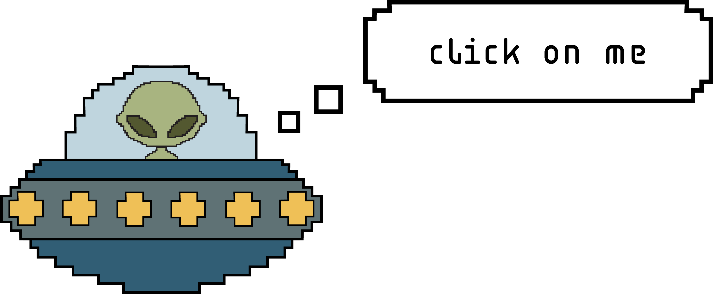
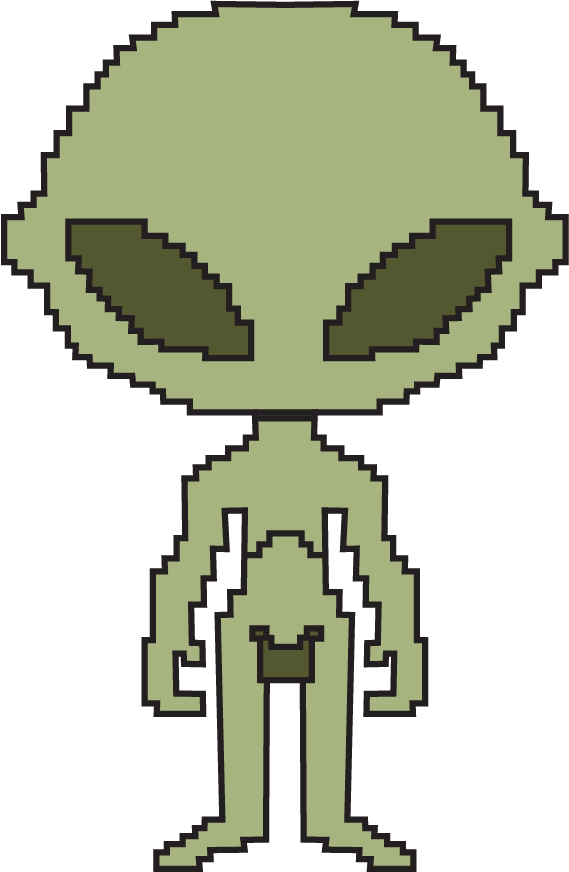
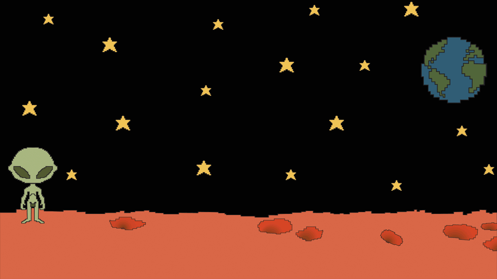

# aliengame
 
## HTML Code
```html
<!DOCTYPE html>
<html>
    <head>
        <meta charset="utf-8">
        <meta http-equiv="X-UA-Compatible" content="IE=edge">
        <title>net website</title>
        <meta name="description" content="">
        <meta name="viewport" content="width=device-width, initial-scale=1">
        <link rel="stylesheet" href="css/style.css">
    </head>
    <body>
            <a href="gamepage.html">
                
            </a>     
    </body>
</html>

<!DOCTYPE html>
<html>
    <head>
        <meta charset="utf-8">
        <meta http-equiv="X-UA-Compatible" content="IE=edge">
        <title>ugly website</title>
        <meta name="description" content="">
        <meta name="viewport" content="width=device-width, initial-scale=1">
        <link rel="stylesheet" href="css/style.css">
    </head>
    <body id="stars">  
        <div class="image-container"> 
        </div>   
        <div id="movingalien">
            <div id="movingalienheader"></div>
            
          </div> 
        <div>
            <a href="playpage.html">
            
            </a>
        </div>  
        <script src="alien.js"></script>
    </body>
</html>

<!DOCTYPE html>
<html>
    <head>
        <meta charset="utf-8">
        <meta http-equiv="X-UA-Compatible" content="IE=edge">
        <title>net website</title>
        <meta name="description" content="">
        <meta name="viewport" content="width=device-width, initial-scale=1">
        <link rel="stylesheet" href="css/style.css">
    </head>
    <body id="game">
    <div>
        
    </div>   
    </body>
</html>


```md
## CSS Code
```css
body {
    margin-top: 50px;
    background-color:black;
    font-family:'Trebuchet MS', 'Lucida Sans Unicode', 'Lucida Grande', 'Lucida Sans', Arial, sans-serif;
    font-style: italic;
    color: white;
    text-align: center;
}

#stars {
    background-image: url('../img/spaceanimation3.gif');
    background-repeat: no-repeat;
    background-size: cover;
    background-position: center;
    background-attachment: fixed;
  }

h1 {
    color:darkturquoise ;
    position: absolute;
    top: 40%; 
    left: 40%;
    transform: translate(-50%, -50%);  
    padding: 10px;
    border-radius: 5px;
}

a {
    text-decoration: none; 
    color: inherit; 
}

h1:hover {
    color: crimson;
}

#ufo {
    align-content: center;
    position: absolute;
    top: 30%;
    left: 15%;
    width: 70%;
    animation-name: float; 
    animation-iteration-count: infinite;
    animation-duration: 5s;
    animation-direction: alternate-reverse;
    animation-timing-function: ease-in-out;
}

@keyframes float {
    from {
        top: 10%; 
    }
    to {
        top: 30%; 
    }
}

.image-container {
    position: relative; 
    size-adjust: 300%;
}

.overlay-img {
    top: 50%; 
    left: 50%; 
    transform: translate(-50%, -50%); 
    width: 30%; 
    z-index: 2; 
    max-width: 150px;
}

#standingalien {
    padding-top: 30%;
}

#movingalien {
    position: absolute; /* REQUIRED for dragging */
   cursor: grab;
   z-index: 5;
   top: 50%;
   width: 20%;
}

#movingalienheader {
    cursor: move;
    width: 10%; 
}

#playbutton {
    width: 50%;
    margin-top: 18%;
    align-content: center;
}

#game {
    background: no-repeat center center fixed;
    background-size: cover;
    height: 100%;
    display: flex;
    justify-content: center;
    align-items: center;
    background-color: black;
}


```md
## JavaScript Code
```js
// document.addEventListener("DOMContentLoaded", () => {
    dragElement(document.getElementById("movingalien"));
});

function dragElement(elmnt) {
    let header = document.getElementById("movingalienheader") || elmnt;
    let pos1 = 0, pos2 = 0, pos3 = 0, pos4 = 0;

    header.addEventListener("mousedown", function (e) {
        e.preventDefault();
        pos3 = e.clientX;
        pos4 = e.clientY;
        document.addEventListener("mouseup", closeDragElement);
        document.addEventListener("mousemove", elementDrag);
    });

    function elementDrag(e) {
        e.preventDefault();
        pos1 = pos3 - e.clientX;
        pos2 = pos4 - e.clientY;
        pos3 = e.clientX;
        pos4 = e.clientY;

        elmnt.style.top = (elmnt.offsetTop - pos2) + "px";
        elmnt.style.left = (elmnt.offsetLeft - pos1) + "px";

        console.log("New Position -> Top:", elmnt.style.top, "Left:", elmnt.style.left);
    }

    function closeDragElement() {
        document.removeEventListener("mouseup", closeDragElement);
        document.removeEventListener("mousemove", elementDrag);
    }
}
;
